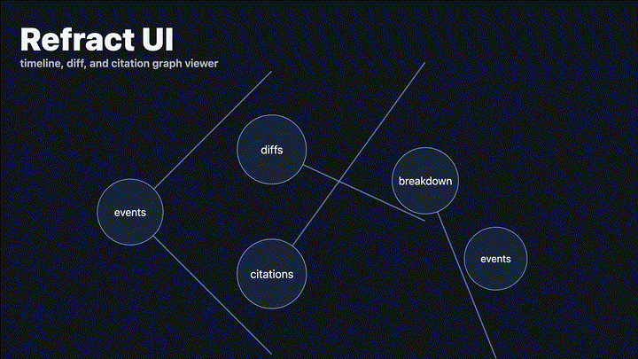

# Refract UI

<p align="center">
  
</p>

Standalone visualization for the [Refract](https://github.com/refract-org/refract) observation engine.

Load any JSONL file of Refract observation events and explore what changed — timelines, diffs, citation graphs, disputes, and event-type breakdowns. No backend needed.

## Quick start

```bash
bun install
bun run dev
```

Open `http://localhost:5173`. Sample data loads automatically. Drag a JSONL file onto the upload zone to inspect your own data.

### Using your own Refract data

```bash
refract export "Bitcoin" --format ndjson > bitcoin-events.jsonl
```

Then drag `bitcoin-events.jsonl` onto the Refract UI upload zone.

## What you'll see

**Timeline** — Every event in chronological order. Click any event to see the word-level diff of what changed. Filter by event type to narrow the view.

**Citations** — Bar chart showing citation additions, removals, and replacements per revision, plus a sortable table of every citation change.

**Certainty** — Confidence scores over time for model-interpreted events.

**Disputes** — Revert clusters, edit velocity per day, and talk page activity.

**Language Changes** — Card grid of wording events (claims reworded, strengthened, softened, removed).

**Schema** — Every JSON key in the loaded data, with types and presence percentage.

**Export** — Download filtered data as JSON, JSONL, or CSV.

## Stack

- Vite + vanilla TypeScript
- No framework dependencies
- DOM-based rendering with CSS custom properties
- Works fully offline after first load

---

[Refract Engine](https://github.com/refract-org/refract) · [Docs](https://refract-org.github.io/refract-docs/) · [npm](https://www.npmjs.com/org/refract-org)
